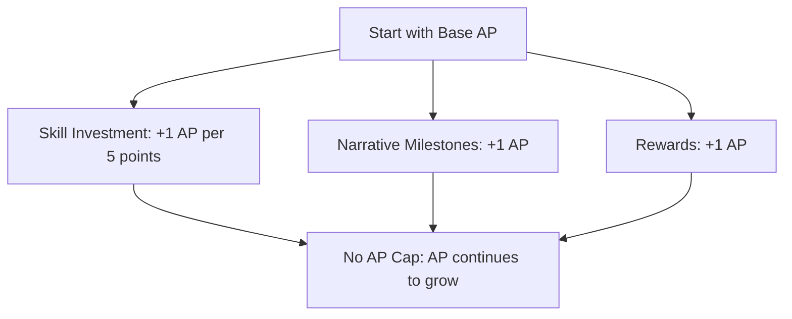
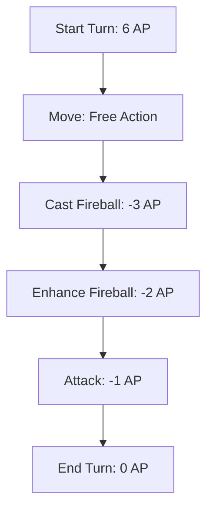
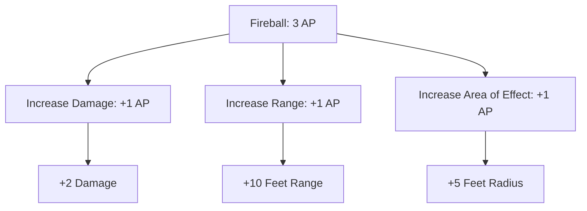

# Shadowforge Action Points (AP) System

## Starting AP Pool

- **Initial Pool:** Players start with a small AP pool, typically 5-6 AP at the beginning of the game.
- **Growth Over Time:** AP increases through skill investments, narrative milestones, and rewards. There is no cap on AP, allowing for continuous growth.

## AP Growth Mechanisms

- **Skill Investments:** AP increases with skill development. Example: Every 5 points invested in combat-related skills grants +1 AP.
- **Milestones:** Significant achievements or narrative milestones reward additional AP.
- **No Levels:** AP growth is tied to skill investment and achievements, not traditional levels.

## Action Costs

- **Standard Actions:** Basic actions like attacking or simple spells cost 1 AP.
- **Enhanced Actions:** More powerful actions cost 2-3 AP, depending on complexity.
- **Augmenting Actions:** Players can spend extra AP to enhance their actions:
  - **Fireball Example:**
    - Base Cost: 3 AP
    - Enhance Damage: +1 AP for +2 damage
    - Increase Range: +1 AP for +10 feet
    - Increase Area of Effect: +1 AP for +5 feet radius
  - **Melee Attack Example:**
    - Base Cost: 1 AP
    - Power Attack: +1 AP for extra damage or knockback effect

## Free Actions

- **Speaking:** Communication is a free action.
- **Minor Interactions:** Small actions (e.g., dropping an item) are free, depending on context.

## Example Turn

- **Starting AP:** Mid-level character with 10 AP.
- **Turn Sequence:**
  1. **Move:** The player moves up to their speed (free action).
  2. **Cast Fireball:** The player casts a Fireball spell for 3 AP.
  3. **Enhance Fireball:** The player spends 2 additional AP to increase damage and range.
  4. **Attack:** The player uses their remaining 1 AP to make a quick melee attack.
- **End of Turn:** The player ends their turn with 0 AP.

## Diagrams

### Diagram 1: AP Growth Over Time

### Diagram 2: Example Turn Flow

### Diagram 3: Augmenting Actions

