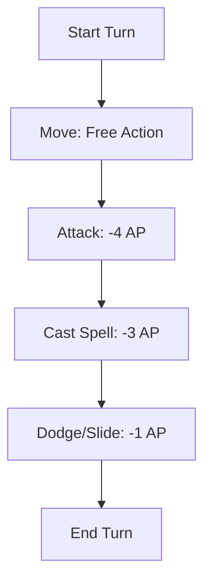
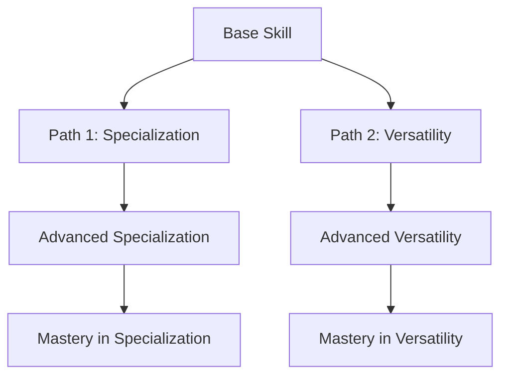
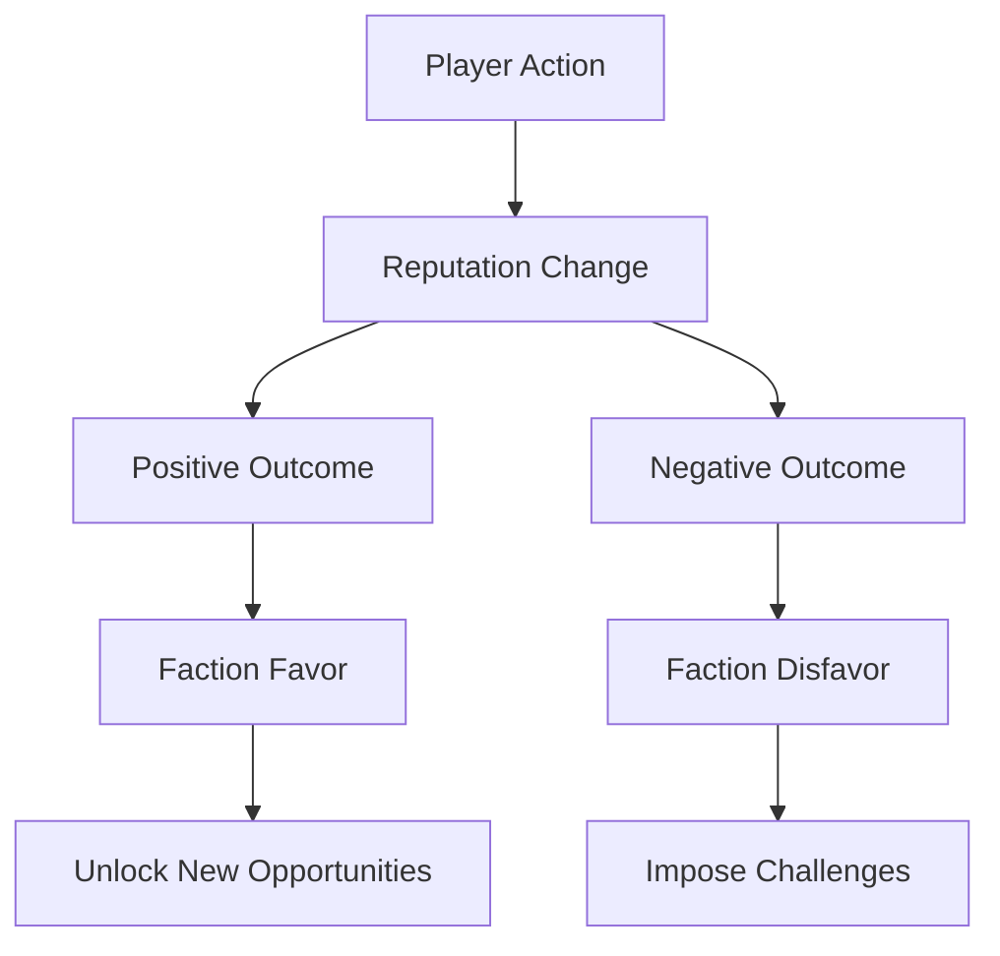
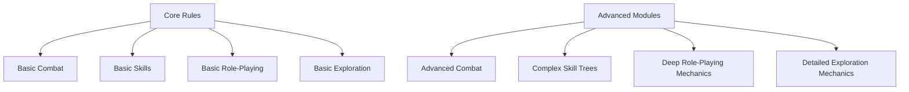

# Shadowforge Development Document

## Table of Contents

1. [Introduction](#introduction)
2. [Core Tenets of Shadowforge](#core-tenets-of-shadowforge)
3. [Action-Packed Combat](#action-packed-combat)
4. [Endless Character Customization](#endless-character-customization)
5. [Balanced Role-Playing and Exploration Mechanics](#balanced-role-playing-and-exploration-mechanics)
6. [Easy to Learn, Deep to Master](#easy-to-learn-deep-to-master)
7. [Feedback and Iterative Development](#feedback-and-iterative-development)
8. [Glossary of Terms](#glossary-of-terms)

## Introduction

Shadowforge is a TTRPG designed to be easy to pick up while offering deep customization and strategic gameplay. This document outlines the core pillars of the game and provides a roadmap for development. It serves as a guide for collaborators to ensure consistency and clarity as the game evolves.

## Core Tenets of Shadowforge

1. **Action-Packed Combat**
   - Fast, fluid, and tactical combat that keeps players engaged with a flexible action economy and dynamic movement rules.

2. **Endless Character Customization**
   - A modular character creation system that allows for deep customization and flexibility, catering to various playstyles.

3. **Balanced Role-Playing and Exploration Mechanics**
   - Robust systems that support role-playing, exploration, and world-building, making all aspects of gameplay equally rewarding.

4. **Easy to Learn, Deep to Master**
   - Streamlined rules that are accessible for new players but offer layers of depth for veterans, with modular complexity to suit different playstyles.

## Action-Packed Combat

### Core Focus

Dynamic and fast-paced combat that minimizes downtime and encourages strategic movement and decision-making.

### Key Elements

- **Action Economy**
  - Flexible Action System: Players have a pool of "Action Points" (AP) to spend on different actions each turn.
  - Multi-Action Turns: Players can perform multiple smaller actions in a single turn by spending AP.

- **Movement and Positioning**
  - Dynamic Movement Rules: Encourage movement with bonuses for flanking, high ground, or cover.
  - Reduced Penalties for Movement: Modify or remove opportunity attacks to encourage tactical repositioning.

- **Combat Abilities and Spells**
  - Flexible Spellcasting: Combine lower-level spells or cast multiple spells in a turn if AP allows.
  - Tactical Abilities: Debuffs, area control, and teamwork-enhancing buffs.

- **Combat Flow and Pacing**
  - Streamlined Turn Structure: Simplify the turn structure to reduce analysis paralysis.
  - Encourage Simultaneous Actions: Allow certain actions to be resolved simultaneously.

- **Rewards for Creativity**
  - Incentivize Creative Solutions: Reward creative tactics in combat with bonuses like extra AP or advantages on rolls.
  - Dynamic Encounters: Encourage diverse approaches like stealth, negotiation, or environmental manipulation.

### Actionable Steps

1. Design and prototype the action point system.
2. Playtest different action point costs for balance.
3. Iterate based on feedback.

### Visual Aid: Sample Turn with Action Points

## Endless Character Customization

### Core Focus

A deep and flexible character creation system that allows players to craft unique characters.

### Key Elements

- **Modular Character Creation System**
  - Point-Based Character Building: Instead of selecting from predefined classes, players start with a pool of points to allocate across various attributes, skills, and abilities. This system allows for a more personalized approach, where each choice directly reflects the player’s concept for their character.
    - **Attributes:** Players can distribute points across core attributes (e.g., Might, Agility, Intelligence), determining their character’s basic capabilities.
    - **Skills:** A wide range of skills should be available, from combat abilities to social skills, crafting, and magic. Players can choose to specialize in a few areas or develop a broad set of skills.
    - **Abilities and Traits:** Players can select or create abilities and traits that define their character’s unique strengths. These could include combat maneuvers, spells, or narrative traits like “Keen Intuition” or “Resourceful.”

- **Character Archetypes and Classes**
  - Hybrid Classes and Archetypes: Offer players the option to either select a pre-made archetype or create a hybrid class by combining abilities from different archetypes. This approach allows for traditional character roles while also supporting more unconventional builds.
    - **Archetypes:** Provide a set of broad archetypes (e.g., Warrior, Mage, Rogue) with suggested abilities and traits. These can serve as templates for new players or starting points for customization.
    - **Hybrid Classes:** Allow players to mix and match abilities from different archetypes to create a unique class. For example, a “Spellblade” might combine abilities from the Warrior and Mage archetypes.

- **Skill and Ability Customization**
  - Skill Trees and Ability Paths: Introduce skill trees or ability paths that offer branching choices, allowing players to develop their skills and abilities in unique directions. This system should provide a sense of progression and reward specialization.
    - **Branching Paths:** Each skill or ability could have multiple paths, leading to different enhancements or entirely new abilities. For example, a “Swordsmanship” skill might branch into “Dual Wielding” or “Master Swordsman.”
    - **Customization Options:** Provide options to modify existing abilities or combine them with others to create new effects. For example, a fire spell could be modified to create an area of effect or add a knockback effect.

- **Narrative-Driven Progression**
  - Milestone-Based Progression: Tie character progression to significant narrative milestones, ensuring that growth feels earned and connected to the story. This approach rewards players for engaging with the narrative and making meaningful choices.
    - **Narrative Milestones:** Identify key events in the campaign (e.g., defeating a major foe, achieving a personal goal) that trigger progression opportunities. Characters might gain new abilities, traits, or skills based on their experiences.
    - **Dynamic Backgrounds:** Allow backgrounds to evolve based on the character’s journey, unlocking new traits, skills, or abilities that reflect their growth.

- **Specializations and Mastery**
  - Specialization Options: Offer characters the opportunity to specialize in certain areas, such as mastering a particular weapon, magic school, or skill. Specializations should provide significant benefits and differentiate characters from one another.
    - **Mastery Paths:** Introduce mastery paths within skill trees that offer powerful abilities or bonuses for characters who fully commit to a specialization. For example, a character specializing in “Fire Magic” might unlock advanced spells or resistances to fire damage.
    - **Unique Benefits:** Specializations should provide unique benefits that make the character stand out. These could be mechanical bonuses or narrative perks, such as recognition from NPCs or access to special resources.

### Actionable Steps

1. Develop a prototype for the point-based character creation system.
2. Playtest hybrid class builds and skill trees.
3. Gather feedback on customization options.

### Visual Aid: Skill Tree Example

## Balanced Role-Playing and Exploration Mechanics

### Core Focus

Creating an immersive world where role-playing and exploration are as rewarding as combat.

### Key Elements

- **Role-Playing Mechanics**
  - Social Interaction System: Introduce mechanics that emphasize and reward social interactions, including diplomacy, deception, negotiation, and relationship-building. This system should offer tangible benefits and consequences based on how players interact with NPCs and other characters.
    - **Conversation Challenges:** Create a system where players engage in “conversation challenges,” rolling against social skills (e.g., Persuasion, Intimidation) to achieve goals such as convincing an NPC, diffusing a tense situation, or uncovering information.
    - **Reputation and Influence:** Implement a reputation system where characters’ actions affect their standing with various factions or NPCs. Positive relationships could open new opportunities, while negative ones could lead to challenges or conflicts.
    - **Narrative Hooks:** Provide narrative hooks tied to social interactions, encouraging players to engage with the story and its characters.

- **Exploration Mechanics**
  - Dynamic Exploration System: Develop a system that makes exploration an active and engaging part of the game, with mechanics that reward discovery, resource management, and environmental interaction.
    - **Exploration Challenges:** Introduce challenges related to navigation, survival, and discovery. Players might need to overcome obstacles like rough terrain, environmental hazards, or deciphering ancient maps.
    - **Resource Management:** Implement resource management mechanics, such as tracking supplies, managing fatigue, or dealing with environmental effects. These elements should add tension and strategy to exploration without becoming overly burdensome.
    - **Discoveries and Rewards:** Encourage exploration by offering rewards for discovering hidden locations, uncovering lore, or finding rare items. These rewards could be mechanical (e.g., skill points, new abilities) or narrative (e.g., revealing important story elements).

- **Narrative and World-Building Integration**
  - Living World Mechanics: Design the game world to feel alive, with NPCs, factions, and environments that react to the players’ actions. This dynamic world-building should encourage players to think about the consequences of their decisions.
    - **Factions and Alliances:** Develop factions within the game world that have their own goals, relationships, and influence. Players’ interactions with these factions can shape the world, leading to alliances, conflicts, or shifts in power.
    - **Environmental Changes:** Create mechanics where the environment can change based on player actions or in-game events (e.g., a village grows into a city, a forest burns down after a dragon attack). These changes should impact gameplay and the narrative.
    - **Lore Integration:** Ensure that lore is woven into the gameplay, with opportunities for players to uncover the world’s history, myths, and secrets through exploration and role-playing.

- **Point-Based Progression**
  - Milestone-Based Point Allocation: Instead of earning experience points (XP), players receive points that they can allocate to skills, abilities, or other character enhancements. These points are awarded based on significant narrative milestones, exploration achievements, and successful role-playing.
    - **Narrative Milestones:** Identify key events in the campaign (e.g., completing major quests, forming alliances, making important discoveries) that grant players points to allocate as they see fit.
    - **Exploration and Role-Playing Rewards:** Provide points for engaging in exploration and role-playing activities, such as uncovering hidden locations, forging relationships, or solving complex social challenges. This encourages diverse playstyles and rewards non-combat achievements.

### Actionable Steps

1. Create prototypes for social interaction and exploration mechanics.
2. Playtest the impact of reputation and faction systems.
3. Iterate based on narrative-driven progression feedback.

### Visual Aid: Reputation and Influence System Flow

## Easy to Learn, Deep to Master

### Core Focus

An accessible game that remains engaging with layers of strategic depth.

### Key Elements

- **Streamlined Core Rules**
  - Clear and Intuitive Mechanics: Focus on creating clear, straightforward mechanics that are easy to understand and apply. Avoid overly complicated rules, and instead prioritize consistency and simplicity in the core gameplay loop.
    - **Unified Mechanics:** Use a consistent set of mechanics across the game (e.g., a single roll system for resolving actions) to reduce the learning curve. For example, a “roll and add” system where players roll a die, add relevant modifiers, and compare to a target number.
    - **Simple Character Creation:** Design the character creation process to be quick and intuitive, providing clear guidance and minimizing the number of decisions a new player must make upfront. Offer pre-built templates or quick-start options for beginners.

- **Gradual Introduction of Complexity**
  - Layered Learning: Introduce advanced mechanics and strategic depth gradually, allowing players to learn the basics first before diving into more complex aspects of the game. This approach helps avoid overwhelming new players while still offering depth for veterans.
    - **Core and Advanced Rules:** Separate the rules into core (essential for play) and advanced (optional or for more experienced players). The core rules should cover everything needed for a basic game, while advanced rules introduce additional layers of strategy.
    - **Progressive Difficulty:** As players level up or advance in the game, gradually introduce more complex mechanics and options. This can include advanced combat maneuvers, intricate role-playing challenges, or detailed resource management systems.

- **Modular Complexity**
  - Customizable Game Modules: Create a modular system where groups can choose the level of complexity they want in their game. This allows for a tailored experience, from a quick and straightforward game to a more detailed and strategic campaign.
    - **Optional Rules Modules:** Offer optional modules that groups can add to the game, such as advanced magic systems, detailed crafting, or intricate political intrigue. These modules should be easy to integrate or ignore, depending on the group’s preferences.
    - **Scalable Challenges:** Design encounters and scenarios that can be scaled in complexity, allowing Game Masters to adjust the difficulty and depth based on the players’ experience levels.

- **Supportive Materials**
  - Comprehensive Guides and Resources: Provide clear, well-organized guides and resources to help both new and experienced players understand and enjoy the game. These materials should be easy to reference during play and offer tips for mastering the game’s deeper elements.
    - **Quick-Start Guides:** Develop quick-start guides that walk new players through the basics, including character creation, core mechanics, and the first session of play. These guides should focus on getting players into the game quickly with minimal prep.
    - **Advanced Strategy Guides:** Offer strategy guides for more experienced players, covering advanced tactics, character optimization, and deep game mechanics. These guides should help players explore the game’s depth and master its complexities.
    - **Online Tools and Resources:** Create digital tools, such as character builders, encounter generators, and rules references, to support players and Game Masters. These tools should enhance the game’s accessibility and ease of play.

### Actionable Steps

1. Develop the core rulebook with essential mechanics.
2. Test optional complexity modules with different player groups.
3. Iterate based on player feedback.

### Visual Aid: Core Rules vs. Advanced Modules

## Feedback and Iterative Development

- Plan for gathering feedback during development through playtesting and surveys.
- Outline the iterative process for updating the game based on feedback.

## Glossary of Terms

- **Action Points (AP):** A pool of points each character has to perform actions during their turn.
- **Hybrid Classes:** Classes created by combining abilities from different archetypes.
- **Reputation System:** A mechanic that tracks a character’s standing with various factions based on their actions.

---
