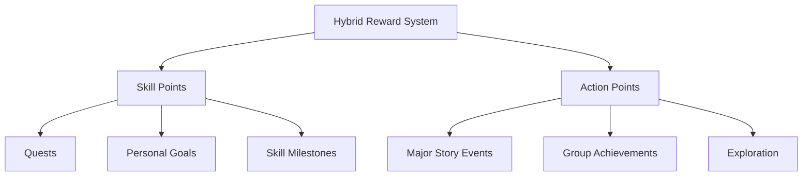

# Reward System: Skill Points and Action Points (AP)

## Skill Points (SP)

- **Purpose:** Enhance specific skills or abilities, allowing players to customize their characters and focus on areas they want to improve.
- **Awarded For:**
  - **Quests:** Completing significant quests, especially those tied to the character's personal story.
  - **Personal Goals:** Achieving individual character goals or milestones.
- **Usage:** Players can invest Skill Points directly into skills, unlocking new abilities or improving existing ones.
  - **Example:** A character completing a personal quest might earn 2 SP, which they can use to increase their a Magic skill, unlocking a more powerful spell.

## Action Points (AP)

- **Purpose:** Increase the character’s action economy, allowing for more actions per turn or enhancing the potency of specific actions.
- **Awarded For:**
  - **Major Story Events:** Completing significant story milestones or defeating major villains.
  - **Group Achievements:** Successful team efforts, such as saving a town or overcoming a difficult challenge.
  - **Exploration:** Discovering new areas, solving complex puzzles, or uncovering hidden knowledge.
- **Usage:** Players gain additional AP that can be used during their turns to perform more actions or augment their abilities.
  - **Example:** After a group successfully defends a city from an invasion, each character gains +1 AP, increasing their action economy for future encounters.

## Implementing the System

### Reward Structure

- **Balanced Distribution:** Ensure that both Skill Points and AP are rewarded evenly throughout the campaign to maintain balanced character progression.
- **Contextual Rewards:** Tailor the rewards to fit the narrative context. For instance, a major combat victory might grant AP, while uncovering ancient knowledge might award SP.

### Progression and Growth

- **Skill Points:** As players invest Skill Points, they unlock new abilities or enhance existing ones, allowing for focused character growth.
- **Action Points:** As players accumulate more AP, their versatility in combat and other scenarios increases, allowing for more dynamic gameplay.

### Example Hybrid Rewards

1. **Completing a Major Quest:**
   - **Reward:** +2 Skill Points (for customization) and +1 AP (for increased action economy).
   - **Narrative Example:** The group defeats the Dark Lord and secures the ancient artifact. Each player receives +2 SP and +1 AP.

2. **Achieving a Personal Goal:**
   - **Reward:** +3 Skill Points (focused growth).
   - **Narrative Example:** A rogue successfully tracks down the person who betrayed them, earning +3 SP to invest in their Stealth or Thievery skills.

3. **Exploration Milestone:**
   - **Reward:** +1 Action Point (enhanced versatility).
   - **Narrative Example:** The party uncovers the Lost City of Arkanth, gaining +1 AP each for their discovery.

## Mermaid Diagram: Reward System Flow

